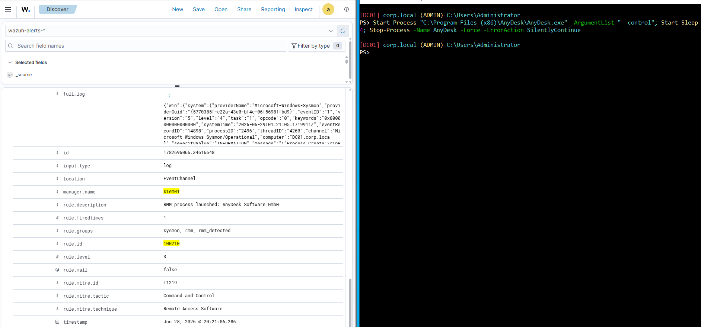
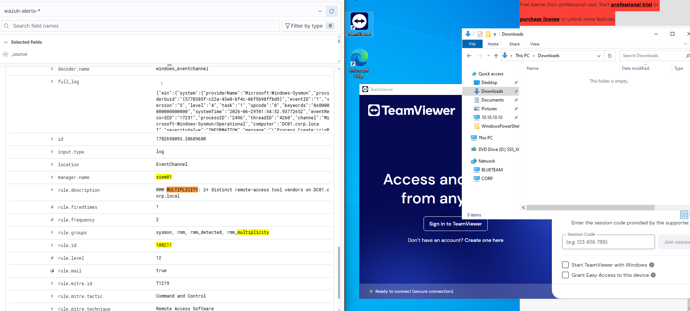

# RMM Multiplicity Detection (Sysmon + Wazuh)

Detecting daisy-chained remote access tools, RMM (Remote Monitoring and Management) abuse mapped to MITRE ATT&CK **T1219**, by spotting two or more distinct RMM vendors active on a single Windows endpoint.

**Companion article:** "One RMM Is IT. Two Is An Incident." Part 1/2 on Medium:
https://medium.com/@johnnymeintel/one-rmm-is-it-two-is-an-incident-1-2-2411904f6ff0

## The problem
Ransomware affiliates increasingly persist through legitimate RMM tools (ScreenConnect, AnyDesk, Atera, TeamViewer) because they are signed, trusted, and often already in use. Per the Huntress 2026 Cyber Threat Report, RMM abuse rose roughly 277% year over year. The presence of one RMM is normal on a managed endpoint; **two distinct vendors on one host is the daisy-chain signal** (a foothold tool deploying a second for resilient persistence). This repo detects that, identifying each tool in a rename-resistant way and correlating for multiplicity.

## How it works
```
Sysmon (endpoint)  ->  Wazuh agent  ->  Wazuh manager rules
   EID 1 tags an RMM by embedded PE Company (rename-proof)
        -> 100210 identify a single RMM launch        (level 3, record)
        -> 100211 two+ distinct vendors, one host, 600s (level 12, alert)
        -> 100250 tune out a benign PowerShell false positive (level 0)
```

## Repository structure
```
rmm-multiplicity/
├── sysmon/                                   Endpoint detection (Sysmon rules)
│   ├── sysmon-eid1-company-anchor.xml          EID 1 ProcessCreate, Company/OriginalFileName anchor
│   ├── sysmon-eid1-originalfilename-anchor.xml  EID 1 earlier OriginalFileName-only approach
│   └── sysmon-eid3-networkconnect.xml          EID 3 NetworkConnect, RMM beacon by image
├── wazuh/                                    Manager correlation rules
│   ├── 100210-rmm-identify.xml                 Base identify (level 3)
│   ├── 100211-rmm-multiplicity.xml             Multiplicity correlation (level 12)
│   └── 100250-tune-psscriptpolicytest.xml      False-positive tune (level 0)
├── scripts/                                  Pipeline verification tooling
│   ├── dc01-agent-diagnostic.ps1               Agent side: service, Sysmon, channel, connectivity
│   └── siem01-manager-diagnostic.sh            Manager side: services, listeners, agents, decoder
└── evidence/
    ├── alerts/100211-multiplicity-alert.json   A real 100211 alert (full decoded fields)
    └── screenshots/                            Build and test evidence
```

Naming convention: Wazuh files are `<rule-id>-<purpose>.xml`; Sysmon files are `sysmon-eid<N>-<anchor>.xml`; scripts are `<host>-<role>-diagnostic.<ext>`; screenshots are `NN-<description>.png`.

## Detection rules

### Sysmon (endpoint)
- **`sysmon-eid1-company-anchor.xml`** - EID 1 (ProcessCreate). Anchors on the embedded PE `Company` field (`AnyDesk Software GmbH`) and, for tools that leave Company unhelpful, `OriginalFileName` (`ScreenConnect.Client.exe`). This is the validated, rename-proof identification: copying `AnyDesk.exe` to any other name still carries `Company = AnyDesk Software GmbH`.
- **`sysmon-eid1-originalfilename-anchor.xml`** - EID 1 (ProcessCreate). The earlier OriginalFileName-only approach, kept to show why it is insufficient: AnyDesk ships `OriginalFileName` **blank**, so an `OriginalFileName=AnyDesk.exe` rule never matches. Read this next to the Company anchor to see the lesson.
- **`sysmon-eid3-networkconnect.xml`** - EID 3 (NetworkConnect). Flags RMM beacons by image name (ScreenConnect, AnyDesk, Tiflux). Name-based and include-only, so it is corroboration, not primary identity.

### Wazuh (manager)
- **`100210-rmm-identify.xml`** (level 3) - chains off the Sysmon EID 1 group (`if_group sysmon_event1`) and tags any process whose `win.eventdata.company` matches a known RMM vendor. Low level: it records, it does not alarm.
- **`100211-rmm-multiplicity.xml`** (level 12) - fires when rule 100210 matches twice within 600 seconds on the **same host** (`same_field win.system.computer`) with **different vendors** (`different_field win.eventdata.company`). Two launches of the same tool do not fire; two different vendors do.
- **`100250-tune-psscriptpolicytest.xml`** (level 0) - suppresses the benign critical that the built-in rule 92213 raises on PowerShell's own `__PSScriptPolicyTest_*.ps1` execution-policy probe files. Scoped tight, so any other executable dropped in Temp still alerts.

## Deploy
**Sysmon (endpoint):** merge the `sysmon/` fragments into your modular Sysmon config (built with olafhartong/sysmon-modular), then update the running Sysmon config.

**Wazuh (manager):** copy the `wazuh/*.xml` into `/var/ossec/etc/rules/`, then:
```
sudo chown wazuh:wazuh /var/ossec/etc/rules/100210-rmm-identify.xml /var/ossec/etc/rules/100211-rmm-multiplicity.xml /var/ossec/etc/rules/100250-tune-psscriptpolicytest.xml
sudo chmod 660 /var/ossec/etc/rules/100210-rmm-identify.xml /var/ossec/etc/rules/100211-rmm-multiplicity.xml /var/ossec/etc/rules/100250-tune-psscriptpolicytest.xml
sudo systemctl restart wazuh-manager
```
The restart succeeding is the validation; a malformed rule file makes it fail.

## Test
- **Positive (multiplicity fires):** on the endpoint, launch AnyDesk, then launch a different vendor (TeamViewer) within 600 seconds. Rule 100211 fires at level 12.
- **Negative (no false alarm):** launch the same tool twice. Rule 100210 fires twice, 100211 does not.
- **Confirm the rename-proof anchor:** `(Get-Item "C:\Program Files (x86)\AnyDesk\AnyDesk.exe").VersionInfo.CompanyName` returns `AnyDesk Software GmbH` regardless of the file name on disk.

## Evidence

Base rule 100210 identifying an RMM launch:



Multiplicity rule 100211 firing on two distinct vendors:



A full decoded 100211 alert is in `evidence/alerts/100211-multiplicity-alert.json`.

## Limitations and next steps (Part 2)
Rule 100211 is **correlational, not causal**: it proves two vendors co-occurred on a host, not that one RMM spawned the other. Part 2 of the project tightens this:
- **Causal cross-vendor parent-child rules** (RMM-A spawned RMM-B) plus an `IntegrityLevel=System` escalation.
- A two-tool design that closes the constraints Wazuh cannot satisfy alone: a single Sysmon event identifies the child rename-proof (Company) but the parent only by filename, and Wazuh cannot join a child's `parentProcessGuid` to the parent's `processGuid`. **Velociraptor** closes both, reconstructing true process lineage and verifying each ancestor's Authenticode signing certificate (a rename-proof parent identity).
- Residual gaps to be honest about: a binary signed with a stolen-but-valid certificate, fully fileless RMM, or a vendor that ships unsigned. Detection is depth, not finality.

## Prior art and attribution
This project **reproduces and tightens** published detection work; it is not a novel technique:
- Elastic prebuilt rules: "Multiple Remote Management Tool Vendors on Same Host" and "First Time Seen RMM Tool".
- Huntress: the daisy-chaining rogue RMM blog series and the 2026 Cyber Threat Report.
- Red Canary: "The dual-use dilemma" on remote access tool abuse.
- LOLRMM (magicsword-io): the RMM indicator catalog.

## Environment
Wazuh 4.14 all-in-one on Ubuntu; Sysmon with olafhartong/sysmon-modular; a Windows endpoint running the Wazuh agent.

## License
MIT. See [LICENSE](LICENSE).
